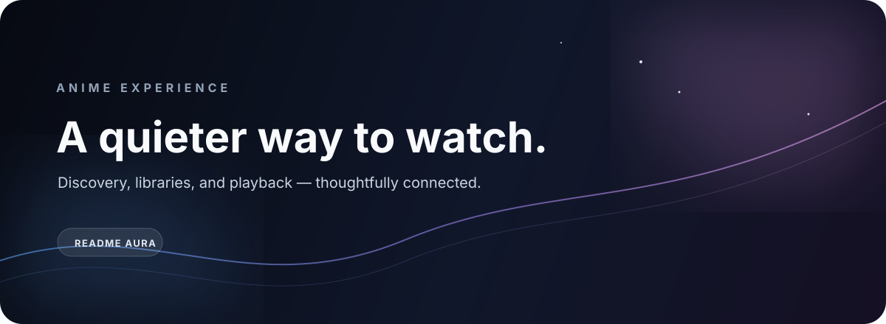

<p align="center"></p>
<p align="center"><a href="https://www.aniraku.tech/">Live experience</a>&nbsp;&nbsp;·&nbsp;&nbsp;<a href="https://github.com/Aniraku/Aniraku-Backend">Service layer</a>&nbsp;&nbsp;·&nbsp;&nbsp;<a href="CONTRIBUTING.md">Contribute</a></p>

> Anime discovery with a little more room to breathe.

## The experience

Aniraku is an open-source anime discovery and viewing frontend built around continuity. Search for something worth watching, keep your library close, and move from metadata to playback without losing the thread.

## The surface

| Space | Purpose |
|:--|:--|
| **Discover** | Catalog, search, trending titles, schedules, filters, and a little room for surprise. |
| **Remember** | Profiles, bookmarks, watch history, and synchronized personal context. |
| **Watch** | A focused player experience with subtitles, dubs, HLS-compatible sources, and provider fallback. |
| **Respect** | Privacy, terms, DMCA, settings, and error states are treated as part of the product. |

## The shape of the system

```text
React + Vite client
        │
        ▼
Go API service ─── Supabase authentication
        │
        ├── AniList metadata
        ├── Miruro provider
        └── Senshi HLS provider
```

## Stack signal

`React` · `JSX` · `Vite` · `CSS` · `AniList` · `Supabase client` · `Vercel`

The frontend’s authoritative implementation lives in `src/`; the service boundary is maintained in [Aniraku-Backend](https://github.com/Aniraku/Aniraku-Backend).

## Start here

```bash
npm install
npm run dev
```

For a production check:

```bash
npm run build
```

Keep credentials outside the repository and read [CONTRIBUTING.md](CONTRIBUTING.md) before changing authentication, synchronization, playback, or upstream integrations.

<p align="center"><sub>Calm interfaces. Reliable edges. Open contribution.</sub></p>
