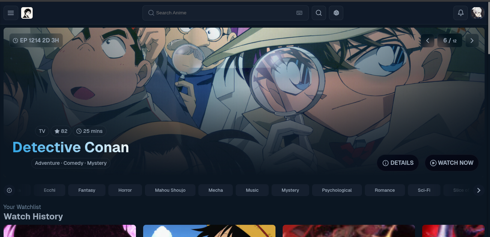

# Aniraku

<p align="center">
  
</p>

<p align="center">
  <strong>Watch anime, no strings attached.</strong> Free, open-source, HD streaming with subs and dubs.
</p>

<p align="center">
  <a href="https://aniraku.vercel.app"><strong>aniraku.vercel.app</strong></a>
  ·
  <a href="https://discord.gg/aniraku">Discord</a>
  ·
  <a href="https://github.com/Aniraku/Aniraku/issues">Report a bug</a>
</p>

---

## What's it got?

- A nice video player — Artplayer, with skip intro, PiP, theater mode, playback speed, keyboard shortcuts, the works. HLS streaming, so it handles spotty connections pretty well.
- SUB and DUB. Switch between sources right from the player. If one goes down it'll try the next one automatically.
- Watch history that actually works. Saves locally even if you're not signed in, syncs to your account when you are.
- Browse by genre, format, status, whatever. Instant search with ⌘K. It's fast.
- A weekly schedule page so you know when stuff airs.
- Random anime button. Sometimes you just want to spin the wheel.
- Trending, top rated, currently airing — the usual discovery stuff.
- PWA installable. Works offline-ish.
- Dark mode. (It's always dark mode, really.)
- Bookmarks, profile, notifications if you sign up.

## Stack

Built with React 18 on Vite. Styled components for styles, TanStack Query for data fetching (caches AniList responses so you're not hammering their API), Artplayer + hls.js for video. Supabase handles auth and user data. Deployed on Vercel.

The streaming backend is a small Go service that resolves where the actual video files live. This repo is the frontend — the backend lives elsewhere.

## Running it locally

You'll need Node 18 or newer.

```bash
git clone https://github.com/Aniraku/Aniraku.git
cd Aniraku
npm install
npm run dev
```

Opens at `http://localhost:3000`. That's it.

If you want auth to work locally, drop a `.env` file with your Supabase keys:

```env
VITE_SUPABASE_URL=https://your-project.supabase.co
VITE_SUPABASE_ANON_KEY=your-anon-key
```

Without it everything still works — just no login, bookmarks, or watch history sync. You can also point it at a local backend if you're running one:

```env
VITE_API_URL=http://127.0.0.1:43211
```

## Project layout

```
src/
├── main.jsx               # Where it all starts
├── App.jsx                # Routes, error boundary, code splitting
├── config.js              # API URL config
├── index.css              # Global styles, CSS vars, dark theme
├── components/
│   ├── Card/              # Anime cards used everywhere
│   ├── NavBar/            # Top nav + slide-out sidebar
│   ├── Footer/            # Site footer with links
│   ├── Hero/              # Big banner on the homepage
│   ├── Trending/          # Trending carousel
│   ├── Featured/          # Featured show section
│   ├── MultiSwiper/       # Swiper.js wrapper
│   └── Loader/            # Skeleton placeholders
├── hooks/
│   ├── useAnime.js        # All AniList data hooks
│   ├── useAuth.jsx        # Auth context and helpers
│   └── useLocalStorage.js # Persistent state without a backend
├── lib/
│   ├── anilist.js         # GraphQL queries and client
│   ├── seo.js             # Dynamic meta tags and JSON-LD
│   ├── supabase.js        # Supabase client setup
│   └── avatars.js         # Generate default avatars
└── pages/
    ├── Home.jsx           # Landing — hero, trending, airing, movies, genres
    ├── Watch.jsx          # The player — Artplayer, hls.js, episode list
    ├── AnimeDetail.jsx    # Detail view — cover, synopsis, episodes, relations
    ├── Catalog.jsx        # Browse / search with filters
    ├── Schedule.jsx       # Weekly airing calendar
    ├── Auth.jsx           # Login and signup
    ├── Profile.jsx        # User settings and watch history
    └── ...                # Random, Admin, Error, legal pages
```

## All the routes

| Path | What's there |
| --- | --- |
| `/` or `/home` | Homepage |
| `/catalog` | Browse everything with filters |
| `/catalog?genre=Action` | Just action anime |
| `/schedule` | Weekly airing schedule |
| `/watch/1-episode-1` | Watch an episode |
| `/anime/1` | Anime detail page |
| `/random` | Surprise me |
| `/login` · `/signup` | Auth pages |
| `/profile` | Your profile |
| `/top-airing` · `/most-popular` · `/movies` · `/tv-series` | Shortcuts that redirect to catalog |

## Keyboard shortcuts

These work on the watch page:

| Key | Does |
| --- | --- |
| `Space` | Play / pause |
| `←` `→` | Skip 10 seconds |
| `↑` `↓` | Volume |
| `F` | Fullscreen |
| `T` | Theater mode |
| `M` | Mute |
| `P` | Picture in picture |
| `C` | Cycle subtitles |
| `D` | Switch source (sub ↔ dub) |
| `N` | Next episode |
| `B` | Previous |
| `,` `.` | Speed down / up |
| `Esc` | Exit fullscreen |

## Deploying

It's a Vite app, so anywhere that hosts static sites works. Vercel is what we use — just point it at the repo, it'll pick up the `vercel.json` config automatically.

## Contributing

Pull requests welcome. Take a look at [CONTRIBUTING.md](CONTRIBUTING.md) for details.

## License

MIT — see [LICENSE](LICENSE).
